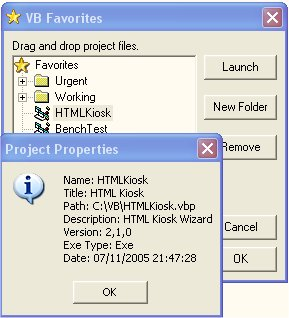



## VB Favorites

### Description

Store and launch your favorite vb projects. Allows quick access to your working projects etc.
 
### More Info
 
Uses windows common controls

             |
---                |---
**Submitted On**   |2005-11-07 17:12:32
**By**             |[Crock](https://github.com/Planet-Source-Code/PSCIndex/blob/master/ByAuthor/crock.md)
**Level**          |Intermediate
**User Rating**    |4.7 (14 globes from 3 users)
**Compatibility**  |VB 4\.0 \(32\-bit\), VB 5\.0, VB 6\.0
**Category**       |[Complete Applications](https://github.com/Planet-Source-Code/PSCIndex/blob/master/ByCategory/complete-applications__1-27.md)
**World**          |[Visual Basic](https://github.com/Planet-Source-Code/PSCIndex/blob/master/ByWorld/visual-basic.md)
**Archive File**   |[VB\_Favorit1946921182005\.zip](https://github.com/Planet-Source-Code/crock-vb-favorites__1-63201/archive/master.zip)

### API Declarations

ShellExecute

